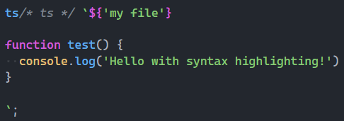

<p align="center">
   <b>Using this package?</b> Please consider <a href="https://github.com/sponsors/arthurfiorette" target="_blank">donating</a> to support my open source work ❤️
  <br />
  <sup>
   Help ts-writer grow! Star and share this amazing repository with your friends and co-workers!
  </sup>
</p>

<br />

<p align="center" >
  <a href="https://kita.js.org" target="_blank" rel="noopener noreferrer">
    
  </a>
</p>

<br />

<div align="center">
  <a title="MIT license" target="_blank" href="https://github.com/kitajs/ts-writer/blob/master/LICENSE"></a>
  <a title="Codecov" target="_blank" href="https://app.codecov.io/gh/kitajs/ts-writer"></a>
  <a title="NPM Package" target="_blank" href="https://www.npmjs.com/package/ts-writer"></a>
  <a title="Bundle size" target="_blank" href="https://bundlephobia.com/package/ts-writer@latest"></a>
  <a title="Last Commit" target="_blank" href="https://github.com/kitajs/ts-writer/commits/master"></a>
  <a href="https://github.com/kitajs/ts-writer/stargazers"></a>
</div>

<br />
<br />

<h1>🧾 Ts Writer</h1>

<p align="center">
  Ts Writer is a simple and lightweight library to generate js and dts files using template strings.
  <br />
  <br />
</p>

## Table of Contents

- [Table of Contents](#table-of-contents)
- [Installing](#installing)
- [Getting Started](#getting-started)
- [Generating code](#generating-code)
- [Syntax Highlighting](#syntax-highlighting)
- [License](#license)

<br />

## Installing

```sh
npm install ts-writer # or yarn add ts-writer
```

```js
const { TsWriter } = require('ts-writer');
import { TsWriter } from 'ts-writer';
```

```js
const { TsWriter } = window.tsWriter;
```

```js
import { TsWriter } from 'https://cdn.skypack.dev/ts-writer@latest';
```

<br />

## Getting Started

Ts Writer is a simple and lightweight library to generate js and dts files using template
strings. It is very simple to use and has a very small footprint, perfect designed to be
used in CLIs and Code generation tools.

There's numerous reasons why code generation increases performance even as javascript is a
JIC interpreted language, this library helps you to generate the code you need at runtime
**in typescript** without having to handle transpiling, multiple files, etc.

## Generating code

The syntax is pretty simple:

```ts
function generate() {
  const { source, types } = ts`${'filename'}

  // Any text here will be put inside the source.content variable above. Under
  // the filename.js file.

  // It will auto remove indentation if you call ts inside a indentation block.
  // like this function.

  exports = 'Hello World';
  exports.__esModule = true;

  ${ts.types}

  // If you want to also generate a filename.d.ts file, you can use the ts.types
  // variable above. Everything after it will be put inside the types variable above.
  // (filename.d.ts)

  export default 'Hello World';
  `;

  // Source result
  source = {
    filename: 'filename.js',
    content:
      '// Any text here will be put inside the source.content variable above. Under\n' +
      '// the filename.js file.\n' +
      '\n' +
      '// It will auto remove indentation if you call ts inside a indentation block.\n' +
      '// like this function.\n' +
      '\n' +
      "exports = 'Hello World';\n" +
      'exports.__esModule = true;'
  };

  // Types result
  types = {
    filename: 'filename.d.ts',
    content:
      '// If you want to also generate a filename.d.ts file, you can use the ts.types\n' +
      '// variable above. Everything after it will be put inside the types variable above.\n' +
      '// (filename.d.ts)\n' +
      '\n' +
      "export default 'Hello World';"
  };
}
```

## Syntax Highlighting

If you are using VSCode, the
[`bierner.comment-tagged-templates`](https://marketplace.visualstudio.com/items?itemName=bierner.comment-tagged-templates)
extension will highlight the template strings if you put `/*ts*/` comment between the `ts`
and its backticks:



## License

Licensed under the **MIT**. See [`LICENSE`](LICENSE) for more informations.

<br />
